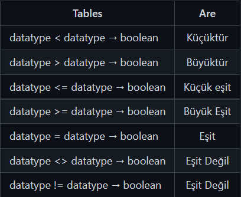

# WHERE ve Karşılaştırma Operatörleri
## WHERE
SELECT komutu ile yaptığımız çalışmalarda bizler tüm sütunların veya ilgili sütunlarda bulunan verilerin tamamını çekmek isteriz. Çoğu durumda ise verilerin tamamını değil belirli koşulları sağlayan verileri görmek isteriz. Bunun için **WHERE** anahtar kelimesini kullanırız.

## WHERE Söz Dizimi
```sql
SELECT <sütun_adı>, <sütun_adı>, ...
FROM <tablo_adı>
WHERE <koşul>;
```

Eğer tablodaki tüm sütunlardaki verileri çekmek istersek asteriks * karakterinden faydalanırız.
```sql
SELECT *
FROM <tablo_adı>;
```

### WHERE Örnek Kullanım
```sql
SELECT title, replacement_cost
FROM film
WHERE replacement_cost = 14.99;
```
Bu sorgumuzda **dvdrental** veritabanında bulunan film tablosundaki **title** ve **replacement_cost** sütunlarında bulunan verileri çekiyoruz ancak bu kez tüm verileri değil **replacement_cost = 14.99** koşulunu sağlayan verileri alıyoruz.

## Karşılaştırma Operatörleri
Yukarıda da bahsettiğimiz üzere WHERE anahtar kelimesi koşul ile birlikte çalışır. Aşağıda SQL ile birlikte kullanılan karşılaştırma operatörlerini görebilirsiniz.

