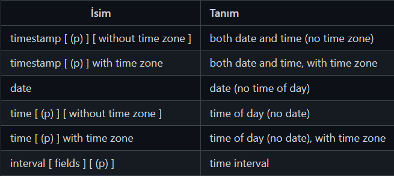

# Veri Tipleri II
## Karakter Veri Tipleri

Sınırlı sayıda karekter kullanımı için VARCHAR veya CHAR veri tipleri kullanılır. VARCHAR veri tipi doldurulmayan karakterleri yok sayar, CHAR veri tipi ise doldurulmayan karakterler için boşluk bırakır. Sınırsız karekter kullanımı için ise TEXT veri tipi kullanılır.
## Boolean Veri Tipleri
TRUE, FALSE veya NULL (Bilinmeyen) değerlerini alabilirler.
- TRUE: true, yes, on, 1
- FALSE: false, no, off, 0
## Zaman / Tarih Veri Tipleri

